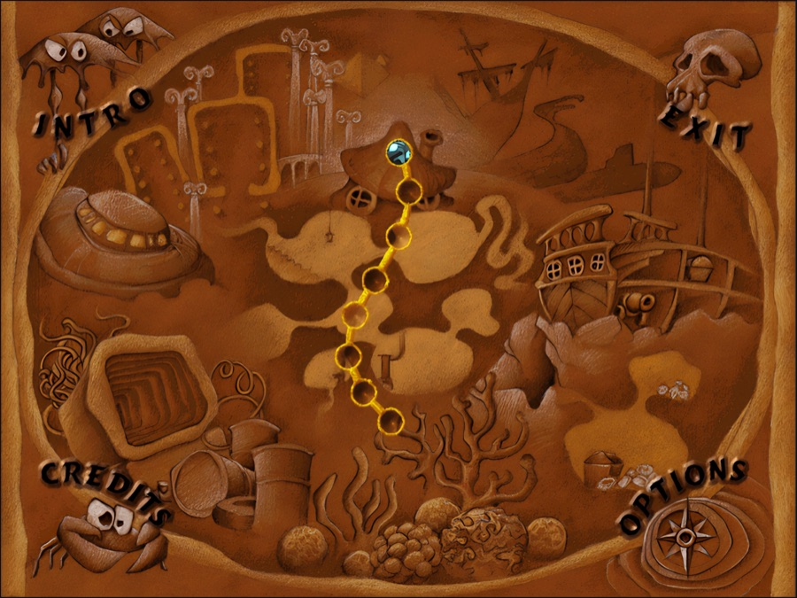
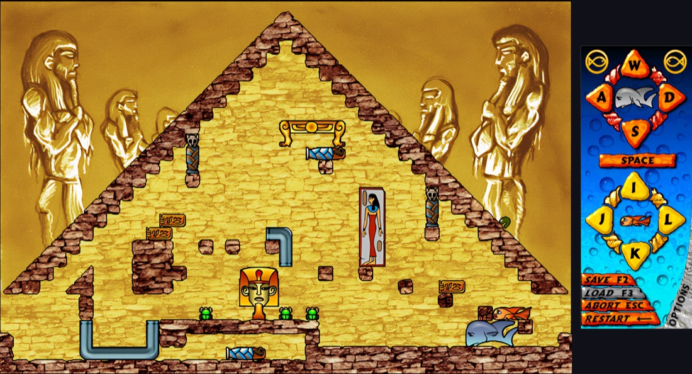

# Fish Fillets 4ever

A faithful web port of **Fish Fillets** (ALTAR interactive, 1998) — the underwater puzzle game where
you move two talking fish around a room without dropping anything on either of them.

### ▶ Play it at **<https://ff4e.github.io/>**

No install, no account, no plugin. It runs in a desktop browser.

## Why this exists

Fish Fillets was written in 1998, in Delphi, for Windows 95. ALTAR released the game's data under the
GPL in 2002, and the engine source survives — and that source is the only complete description of how
the game actually *behaved*: every push, every fall, every line the two fish say to each other.

This port translates that source, function by function, so the game can be played on the web and on
machines nobody had in 1998 — while behaving exactly as it did then. Where this port differs from the
original, that is a bug, and it is written down.

That is also why FFNG, the well-known remake, was not the starting point. FFNG is a good game and a
*re-implementation*: it rebuilt the puzzles from the outside, in C++, on a new engine. This goes the
other way — outward from ALTAR's own code, keeping the original's names, its quirks and its bugs.

**The one thing deliberately changed is how it looks.** The art was drawn for a 640×480 screen, and on
a modern display that is a small soft rectangle. So the port ships an AI-upscaled art tier: the same
pictures, the same layout, the same everything the game does — just enough resolution to be worth
looking at today. The 1998 256-colour look and FFNG's truecolor art are both still there, one switch
away in Options.

**Done** means all 72 rooms playable end to end, the dialogue and voices in place, and every known
deviation from the original either fixed or written down in [`KNOWN_ISSUES.md`](KNOWN_ISSUES.md).

## What "faithful" means here, in practice

- **The rules are ported, not re-derived.** The push physics, gravity and support graph, the
  fish-size-aware pathfinding, the subtitle scheduler, the idle chatter, the death commentary — each
  is a translation of a named Delphi routine (`posun_objekt`, `padani`, `najdi_smer`, `NovyTitulek`,
  `StdKecej`, `StdSmrt`), and the comment above it says which one.
- **The citations are kept.** Over 500 distinct references like `URoom.pas:15576` sit in the code —
  into `URoom.pas`, `UMain.pas`, `Uovl.pas`, `Ttr.pas`, `Cheaty.pas`, `Help.pas`, `RSound.pas`,
  `USoutez.pas` and `zaklad.pas` — so any behaviour can be checked against the source it came from
  rather than argued about.
- **The quirks are kept too.** The Tetris minigame rotates backwards, Down rotates and Space slams,
  because that is what `Ttr.pas` does. A lone fish dying does not restart the room — the survivor
  keeps playing and comments on it — because that is what the original does.
- **It is checked, not asserted.** 70 of the 72 rooms have a recorded solution that is replayed
  through the engine on every push, and must end won, with no death and no blocked move.
- **The data is the original's data**, extracted from the GPL release rather than re-authored. Audio
  and video are re-encoded for the web (AAC, H.264) because 64 MB of 1998 PCM is a loading screen;
  every one of those transcodes is measured and justified in [`ASSETS.md`](ASSETS.md).

## Where it is now

Playable start to finish. All 72 rooms are in, with their scripts, dialogue, voices, subtitles in
Czech and English, music, the world map and its record panel, saves, the original cheat codes, the
Tetris minigame, and the intro and ending movies. The solvability net replays 70 of the 72 rooms on
every push.

What is left is polish and the known divergences — [`KNOWN_ISSUES.md`](KNOWN_ISSUES.md) is the honest
list. [`HISTORY.md`](HISTORY.md) has the milestone log, if you want the order it was all built in.

## Found a bug, or want something?

Open the **Options** panel — right-click the control panel in a room, or the *Options* corner of the
world map — and use the **Send feedback** strip at the bottom. It writes the report for you: what you
type, the room you were in, the build, and the **move record** for that room, so the moves that led to
a bug can be replayed instead of guessed at. Then it offers three ways out —
[a GitHub issue](.github/ISSUE_TEMPLATE/), an email to `fish_fillets@icloud.com`, or copy the text and
put it wherever you like.

**Nothing is ever sent automatically.** There is no server behind this — the site is static on GitHub
Pages — so a report only leaves your browser when you click one of those three, and the whole message
is on screen before you do. An *idea* collects only which build it was written against; the room and
browser diagnostics are gathered for bug reports and nowhere else.
[`src/platform/feedback.ts`](src/platform/feedback.ts) is the code, and says what a report may contain
and why.

## Credits & license

- **Original game:** *Fish Fillets* (1998) by **ALTAR interactive**. This is an unaffiliated
  fan port; all original assets and trademarks belong to their owners.
- **Game data:** derived from the GPL-licensed **[fillets-ng](https://fillets-ng.sourceforge.net/)**
  data.
- **Fonts:** Mulish / Manrope / Jost (SIL OFL 1.1, licenses in `public/fonts/`); GNU FreeFont
  FreeSans (GPL).
- **This port:** licensed **GPL-2.0-or-later** — see [`LICENSE`](LICENSE).

Full attribution: **[CREDITS.md](CREDITS.md)**.

## For developers

Start with **[`AGENTS.md`](AGENTS.md)** — setup, the port traps, how much checking a change needs, and
what each test net actually proves. Then:

| | |
|---|---|
| [`CONTRIBUTING.md`](CONTRIBUTING.md) | repo hygiene, commit rules, deploy |
| [`MAP.md`](MAP.md) | the layout, and file-by-file maps of `src/app/` and `src/render/` |
| [`TESTING.md`](TESTING.md) | the suites, what they prove, and what they cost |
| [`ASSETS.md`](ASSETS.md) | where the original data comes from, and every transcode applied to it |
| [`KNOWN_ISSUES.md`](KNOWN_ISSUES.md) | where the port still differs from the original |
| [`HISTORY.md`](HISTORY.md) | the M0–M8 milestone log |
