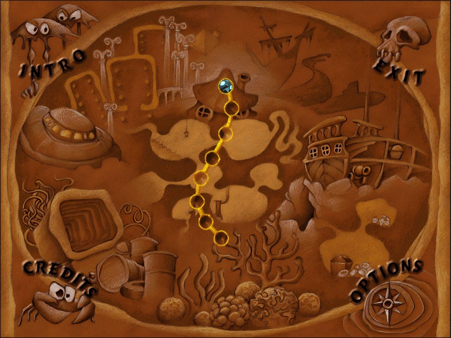
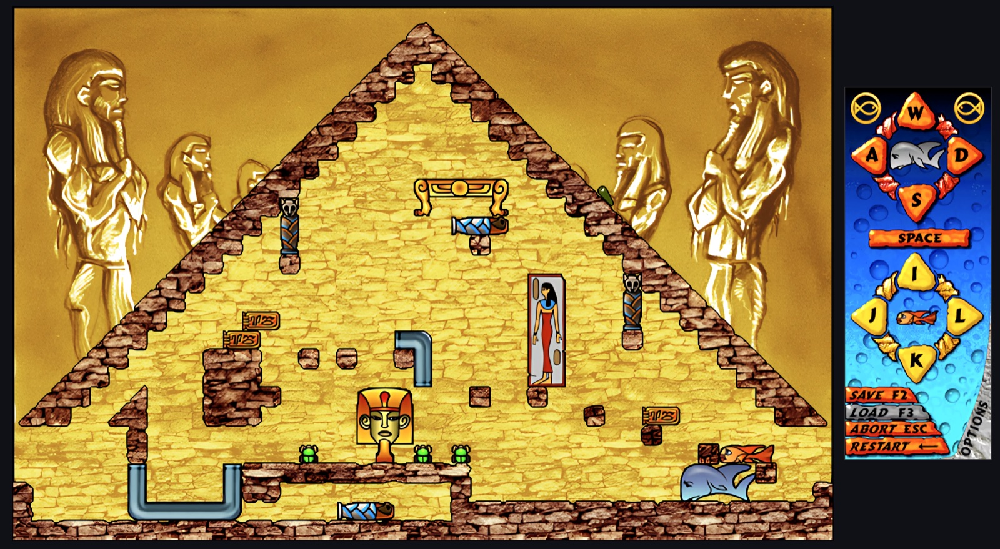

# Fish Fillets 4ever

A faithful web port of **Fish Fillets** (ALTAR interactive, 1998) — the underwater puzzle game
where you move two talking fish around a room without dropping anything on either of them.

The goal: a modern implementation, ported function-by-function from the original Delphi/Pascal
source for behavioral fidelity, with improved graphics, that runs on any modern hardware.

### ▶ Play in a browser at **<https://ff4e.github.io/>**, or get the **[App Store app](https://apps.apple.com/us/app/fish-fillets-forever/id6812738745)** for iPhone/iPad.

No install, no account, no plugin needed for the browser version. See
**[about.html](https://ff4e.github.io/about.html)** for platform details.

## This project is open

This is a public, open project and contributions are welcome — bug reports, fixes, ports to new
platforms, anything. See **[CONTRIBUTING.md](CONTRIBUTING.md)** for repo hygiene and commit rules,
and **[AGENTS.md](AGENTS.md)** for how the codebase is organized and what it costs to change it.
Found a bug? Use the in-game **Send feedback** strip (Options panel), open a
[GitHub issue](.github/ISSUE_TEMPLATE/), or email `fish_fillets@icloud.com`.

## Credits & license

Original game by **ALTAR interactive** (1998); this is an unaffiliated fan port. Game data derives
from the GPL-licensed **[fillets-ng](https://fillets-ng.sourceforge.net/)** project. This port is
licensed **GPL-2.0-or-later** — see [`LICENSE`](LICENSE). Full attribution: **[CREDITS.md](CREDITS.md)**.

## More docs

[`KNOWN_ISSUES.md`](KNOWN_ISSUES.md) · [`HISTORY.md`](HISTORY.md) · [`MAP.md`](MAP.md) ·
[`TESTING.md`](TESTING.md) · [`ASSETS.md`](ASSETS.md)
